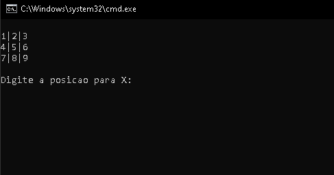
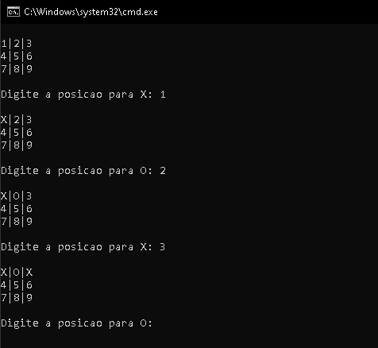
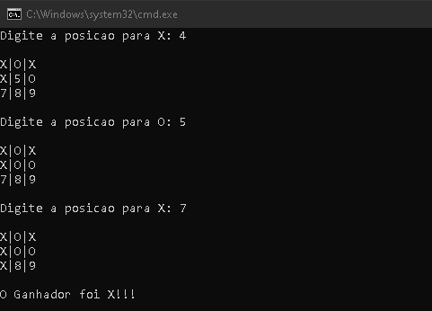
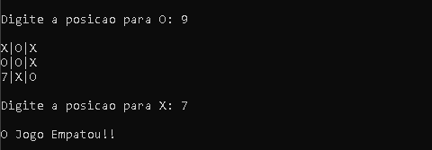

# 🎮 Jogo da Velha em C

Um jogo da velha (tic-tac-toe) clássico desenvolvido em **linguagem C**, jogado diretamente no console/terminal. Projeto criado como atividade de aprendizado para a disciplina de Programação na **Universidade Federal do Piauí (UFPI)**.

## 📋 Sobre o projeto

Este projeto implementa as regras tradicionais do jogo da velha para dois jogadores (X e O), com:

- Tabuleiro numerado de 1 a 9 para facilitar a escolha da posição;
- Verificação de vitória em linhas, colunas e diagonais;
- Verificação de posições já ocupadas;
- Detecção de empate quando todas as rodadas se esgotam sem vencedor.

## 🖥️ Como o jogo funciona

1. O tabuleiro é exibido no console com as posições numeradas de 1 a 9.
2. O jogador da vez (começando por `X`) digita o número da posição desejada.
3. O programa valida se a posição está livre; caso contrário, solicita uma nova jogada.
4. Após cada jogada, o programa verifica se houve um vencedor.
5. O jogo continua até haver um vencedor ou até as 9 posições serem preenchidas (empate).

## 📸 Capturas de tela

**Tabuleiro inicial:**



**Partida em andamento:**



**Tela de vitória:**



**Tela de empate:**




## 🚀 Como baixar e executar o jogo

### Pré-requisitos

- Um compilador C instalado, como o **GCC**.
  - Windows: instale o [MinGW](https://www.mingw-w64.org/) ou use o WSL.
  - Linux: geralmente já vem instalado; caso não, instale com `sudo apt install gcc`.
  - macOS: instale as Ferramentas de Linha de Comando do Xcode com `xcode-select --install`.
- **Git** instalado para clonar o repositório ([download aqui](https://git-scm.com/downloads)).

### Passo a passo

1. **Clone o repositório do GitHub:**

   ```bash
   git clone https://github.com/anaClarissi/jogo-da-velha.git
   ```

2. **Acesse a pasta do projeto:**

   ```bash
   cd jogo-da-velha
   ```

3. **Compile o código com o GCC:**

   ```bash
   gcc jogo_da_velha.c -o jogo_da_velha
   ```

4. **Execute o jogo:**

   - No Linux/macOS:
     ```bash
     ./jogo_da_velha
     ```
   - No Windows:
     ```bash
     jogo_da_velha.exe
     ```

5. **Divirta-se!** Digite os números de 1 a 9 correspondentes às posições do tabuleiro para jogar.

### Alternativa: baixar sem usar Git

Caso não queira usar o Git, é possível baixar o projeto diretamente pelo GitHub:

1. Acesse a página do repositório no GitHub.
2. Clique no botão verde **"Code"**.
3. Selecione **"Download ZIP"**.
4. Extraia o arquivo ZIP em uma pasta de sua preferência.
5. Siga a partir do passo 3 da seção anterior (compilação e execução).

## 🎯 Como jogar

- O tabuleiro é representado assim, com as posições numeradas:

  ```
  1|2|3
  4|5|6
  7|8|9
  ```

- Os jogadores se alternam entre `X` e `O`, começando por `X`.
- Digite o número correspondente à posição em que deseja jogar e pressione Enter.
- Vence quem completar uma linha, coluna ou diagonal com o próprio símbolo.
- Se todas as posições forem preenchidas sem um vencedor, o jogo termina em empate.

## 🛠️ Tecnologias utilizadas

- **Linguagem:** C
- **Compilador recomendado:** GCC
- **Ambiente:** Terminal/Console

## 🎓 Contexto acadêmico

Projeto desenvolvido como exercício de aprendizado de lógica de programação e estruturas de dados (matrizes, funções e laços de repetição) para a disciplina de Programação da **Universidade Federal do Piauí (UFPI)**.

## 📄 Licença

Este projeto foi desenvolvido para fins educacionais.